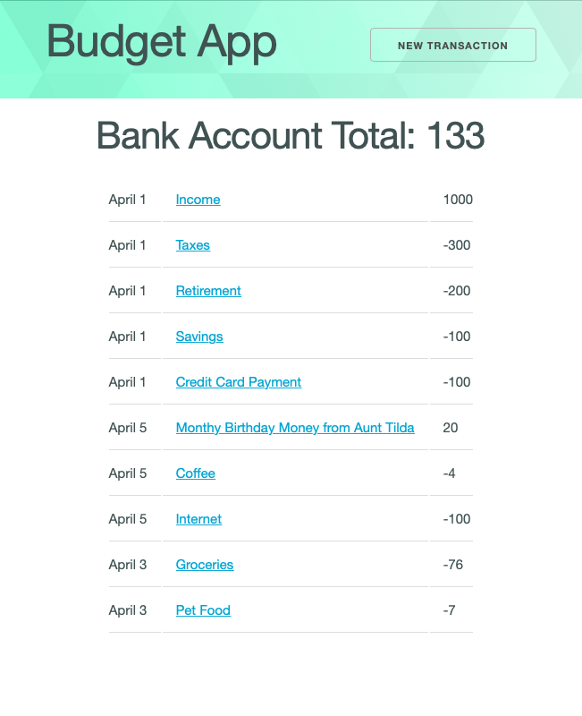
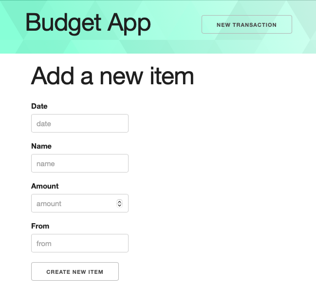

# Full Stack Budgeting App

Budgtr is an application where people can log their financial transactions. Building this application will require you to bring together all you've learned about JavaScript, building websites, React, servers and RESTful routes.

## Project scoring

This project has three different parts on which you will be graded. Each part is weighted differently.

- 70% **Completion**.
- 20% **Mastery**.
- 10% **Stretch goals**

In total, you must receive at least 70% to complete this project. For example, you you could attain 55% of points from completion, 10% of points through mastery and 5% of the points through stretch goals.

## Completion

1. Create a GitHub repository for both the front-end and the back-end applications and upload your code to it.
1. Your front-end repository should have a `readme.md` file with setup instructions for your application.
1. Both the front-end and back-end applications should be successfully deployed to the web.
   - Your readme should also include links to your back-end GitHub repository, both of your deployed URLs, and a link to the Trello board you used to manage your work.

#### Back-end feature requirements

To complete the back-end application, you will need to build a RESTful server that performs CRUD actions on a single resource.

4. Your server should incorporate at least one table that, at minimum, includes:
   - `id` - A unique number for each item
     - `item_name`- string - the name of the transaction (ie: income, savings, cat food, etc.)
     - `amount` -number - the amount of the transaction
     - `date`- string - the date should be a simple string. As a bonus activity, use the date object and date input field and format it to be human-readable
     - `from` - string - who this transaction was with (ie. employer, bank, pet store, grocery store, etc)
     - `category` - string - what category does this fall into (income, savings, pets, food, etc)
1. A route exists to create new resources.
1. A route exists to read all resources.
1. A route exists to read a single resource.
1. A route exists to update a single resource.
1. A route exists to delete a single resource.
1. An appropriate "Not Found" response is given when a route is requested that does not match the created routes.

##### Back-end Example

|  #  | Action  |        URL        | HTTP Verb |    CRUD    |                  Description                   |
| :-: | :-----: | :---------------: | :-------: | :--------: | :--------------------------------------------: |
|  1  |  Index  |   /transactions   |    GET    |  **R**ead  |   Get a list (or index) of all transactions    |
|  2  |  Show   | /transactions/:id |    GET    |  **R**ead  | Get an individual view (show one transactions) |
|  3  | Create  |   /transactions   |   POST    | **C**reate |           Create a new transactions            |
|  4  | Destroy | /transactions/:id |  DELETE   | **D**elete |             Delete a transactions              |
|  5  | Update  | /transactions/:id |    PUT    | **U**pdate |             Update a transactions              |

> **Note:** All of the above routes should work both with an application like Postman and a front-end framework like React

#### Front-end feature requirements

To complete the front-end application, you will need to build a React application that allows for CRUD operations to be performed on a single resource. You will also need to display the data thoughtfully and clearly.

11. All pages should include the same navigation bar, which includes the name of the application and a button to create a new resource.
1. You should have an Index page that presents all of the resources in your database table.
1. After clicking on a single resource, you should be brought to a Show page which includes more detailed information about the specific resource.
1. When the button in the navigation bar to create a new resource is clicked, you should be brought to a new page that includes a form to create a new resource.
1. Forms should be properly labeled and the `type` of inputs should be properly set. For example, an input that requires a `number` should have type `number`, not `text`.
1. When a new resource form is submitted, the resource should be created in the database and the user should be brought to that new resource's Show page.
1. On the resource's Show page, there should be a button to edit the current resource. When clicked, the user is brought to a form page with data already filled in that can be edited.
1. When an edited resource form is submitted, the resource should be edited in the database and the user should be brought to that new resource's Show page.
1. On the resource's Show page, there should be a button to delete the current show page.
1. Using the resource's data, perform a calculation that can be performed on the front-end application and displayed to the user on the Index page. For example, the bank account total should be visible. In addition to the total, the CSS should change based on the value - use a greenish color if the bank account total is above 100, use a yellowish color if the bank account total is between 0 and 100 and a reddish color if the bank account total is less than 0. You can change the background or text or both.

### Mastery rubric

This section of the project is designed to measure your increasing skill at writing good code and following best practices.

To view components of the mastery rubric, view the appropriate assignment on Canvas.

### Stretch goals

This section of the project measures your ability to go above and beyond in creating your project. To score points in this section, you should incorporate a feature, technology, or skill not explicitly required by the project instructions.

When you submit your pull request, _make sure to include a description of any stretch goals you implemented._ You may choose from the list below or come up with features or tasks that are more relevant to your specific implementation of the project.

- Make `categories` a `select` HTML element on the new/edit forms to allow the user to choose from a pull-down menu from the available categories, and allow for the addition of new categories to the options menu.
- Display the bank account total in the nav bar (or similar component that is visible on all views), instead of just on the index page.
- Add helpful errors to users when they try to create or edit items with invalid data
- Use the date object for the date, instead of just a string. Be sure to format it on the front-end to make it human-readable. Try using the `date` input type as well.
- Use a checkbox, separate input or similar strategy to allow the user to select whether the transaction is a deposit or withdrawal. If it is a withdrawal, make sure the value subtracts and deposit values add. By default, your user would have be entering values that are positive or negative.
- Create a fake user login, similar to the example given in the official[ React Router GitHub Repository](https://github.com/remix-run/react-router/tree/dev/examples/auth), and allow viewing/updating resources by a user.
- Add a library like [chartjs](https://www.chartjs.org) or [D3](https://www.chartjs.org) to provide visualizations the budget app.

## Project setup and overview

There are no tests for this project and you _should not_ fork and clone this repository. Instead, create your own repositories.

## Example application

